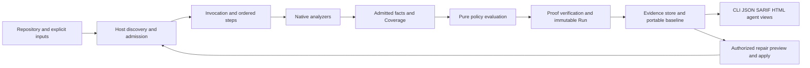

# OpenSIP product contracts

This consolidated contract set describes the complete intended product selected
by D-371. Its current review and application standing is recorded in the
[correction record](../../../coop/design-corrections/README.md) and the
[central readiness register](../../architecture/08-decision-and-readiness-register.md#unified-product-design-readiness).
These contract bytes alone grant no readiness grade or implementation authority.

The product has one host for discovery, input admission, authority, orchestration,
evaluation, evidence storage and output. Language-specific analyzers contribute
facts and Coverage through versioned protocols. The evaluator is pure. An
invocation can compose analysis, queries, imports, policy changes, repair and
verification; only an authoritative analysis seals a source-bound Run.

Read the five contracts together:

1. [Identity and evidence](identity-and-evidence.md): exact semantic identities,
   independent replay, durable defaults, retention, purge and recovery.
2. [Security and lifecycle](security-and-lifecycle.md): repository boundaries,
   time/trust recovery, revocation, supported platform profiles, migration and
   concurrent operations.
3. [Native evidence](native-evidence.md): TS/JS/Rust capability cells, sealed
   dependency/prepared inputs, resolution completeness and clone candidates.
4. [Workflows and surfaces](workflows-and-surfaces.md): invocations, baseline and
   changed-code audit, typed imports/comparison, policy/review/repair and output.
5. [Admission and qualification](admission-and-qualification.md): exact numeric
   parsing, independent report oracles and release measurement requirements.

The Fallow-inspired behavior belongs in these contracts now, even where its
implementation is scheduled later. Zero-config discovery, stable output,
composed invocations, retained evidence, changed-code gating and advisory
boundaries apply across languages. Native syntax/resolution, clone normalization
and runtime-format adapters are deliberately language-specific.

Historical contracts and preview reviews remain immutable evidence. They do
not provide an alternative current command grammar or a competing preview
product. The correction crosswalk names exact successor selectors and retained
obligations; the central readiness register remains the sole completion
checklist. Passing design reference checks is not product qualification.

Current correction status and review blockers: [correction record](../../../coop/design-corrections/README.md).
