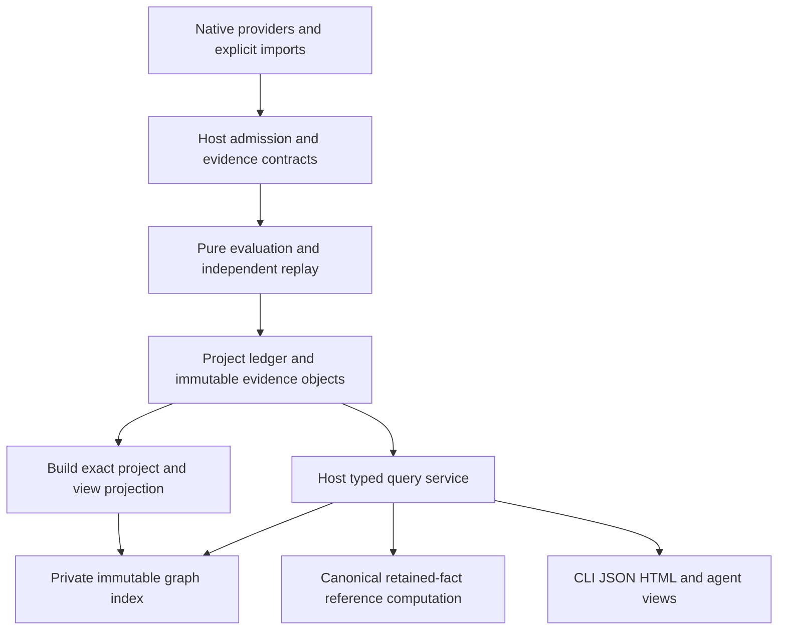

**HydraDB × OpenSIP: architecture fit-gap assessment**

Assessed 8 September 2026. Recommendation: **use HydraDB as architectural inspiration; do not adopt it as OpenSIP’s authoritative store, default query engine, or preview dependency. Keep an optional future Map projection as a conditional experiment.**

OpenSIP’s difficult requirements are semantic completeness, exact retained evidence, independent replay, historical comparison, and a self-contained offline install. HydraDB addresses a different problem: serving graph queries over durable object storage with independently scalable query and indexing processes. There is useful overlap in traversal acceleration, but adopting the database would leave OpenSIP’s hardest obligations intact and add a second persistence and operational system.

**Assessment scope and standing**

I inspected the actual working tree at `/Users/sb/code/opensip-ai/opensip_arch`, including its uncommitted current product contracts, rather than treating the shipping TypeScript prototype as the intended architecture. Its Git baseline was `2580a9a8`; the working tree contains significant design changes. D-369 accepted a limited preview design. D-371 selects one complete intended-product design, implemented in stages. The current correction record says **source21 awaiting independent review**; full-product acceptance and implementation authorization remain incomplete. The assessment uses those candidate contracts as intended requirements, not as evidence of a qualified product. [Current direction](/Users/sb/code/opensip-ai/opensip_arch/docs/v2/architecture/10-mvp-and-future-scope.md:1), [readiness](/Users/sb/code/opensip-ai/opensip_arch/docs/v2/architecture/08-decision-and-readiness-register.md:374), [correction standing](/Users/sb/code/opensip-ai/opensip_arch/docs/coop/design-corrections/README.md:1).

HydraDB was cloned from public `main` at **`6a2fbb192f37f51a93690a2ae2d2f5e27e6e4219`**, whose commit date is 13 August 2026. Findings below distinguish inspected implementation, repository claims, published measurements, and proposed integration. This was a source/design evaluation: I did not execute HydraDB or claim OpenSIP performance measurements. The local environment did not resolve its native parser and GraphBLAS dependencies through the prerequisite checks.

**What OpenSIP actually needs**

| Area | Observed OpenSIP requirement | Architectural consequence |
|---|---|---|
| Product | Local-first evidence and assessment platform; native TS/JS and Rust roles; analysis, imports, comparison, policy, advisory review, and separately authorized repair | A general graph service is a supporting mechanism, not the product center. |
| Authority | Host constructs/adopts inputs and Plans, admits facts and Coverage, controls policy/evidence/finalization; evaluator is pure | Database queries cannot mint evidence, decide sufficiency, or choose verdicts/exits. |
| Preview | TS import-cycle analysis, doctor/help/version; no authoritative Runs or durable analysis-result reuse | Adding a persistent graph system does not solve a preview requirement. |
| Facts | Files/symbols/spans/imports/calls/references/types and derived relations, with schema, producer, source, scope, resolution and provenance | Preserve typed relations and their individual sufficiency rules; avoid a lossy generic edge model. |
| Evidence | Content-derived identities and immutable source/Plan/fact/proof/Run closure; attempts and receipts have separate operational identity | A database transaction sequence is not an OpenSIP semantic identity. |
| Storage | Project-local immutable objects, transactional ledger, distinct lifecycle/trust state, one project writer, reader snapshots | Preserve the already specified local commit, lock, recovery and custody contracts. |
| History | Replayable retention at authoritative seal; immutable assurance separate from changing availability; portable baselines and detector pivots | Current-state graph consistency cannot replace historical evidence custody. |
| Query | Typed read-only operations over a selected sealed view, with Coverage, availability, bounds and stable pagination | Hide physical storage and query language behind the existing host query boundary. |
| Map | Orientation and advisory judgments; may cite host results, cannot change Control verdicts | A graph projection is plausible here if its freshness, provenance and authority limits remain explicit. |

Sources: [product scope](/Users/sb/code/opensip-ai/opensip_arch/docs/v2/architecture/10-mvp-and-future-scope.md:10), [preview handoff](/Users/sb/code/opensip-ai/opensip_arch/docs/coop/completion/reference-architecture.v2.md:1), [product contract map](/Users/sb/code/opensip-ai/opensip_arch/docs/v2/contracts/product-v1/README.md:1), [fact plane](/Users/sb/code/opensip-ai/opensip_arch/docs/coop/architecture/04-fact-plane.md:1), [current identity/evidence contract](/Users/sb/code/opensip-ai/opensip_arch/docs/v2/contracts/product-v1/identity-and-evidence.md:1326).

The graph workload is real. OpenSIP names callers, impact closure, test-selection relationships, package/import SCCs, and duplicate grouping. However, these are several kinds of computation: joins and identity lookup, graph traversal, complete SCC computation, and body normalization/similarity. They do not all improve by moving to a graph database. The existing Gortex register already distinguishes an **exact accelerator**, whose removal changes only performance, from a **semantic producer**, whose algorithm can change edges, findings, ranking or omissions. [Graph requirements and boundary](/Users/sb/code/opensip-ai/opensip_arch/docs/coop/architecture/04-fact-plane.md:11), [Gortex dispositions](/Users/sb/code/opensip-ai/opensip_arch/docs/coop/GORTEX-BORROW-REGISTER.md:40).

Search needs are also narrower than “add a search database.” The current query schema contains fact/finding/artifact retrieval plus `graph.neighbors`, `graph.path`, and `graph.reach`. Map guidance adds symbol-oriented navigation and possible advisory similarity. I found no selected requirement to bundle an embedding engine or a particular full-text engine. Do not introduce a vector database, BM25 engine, or universal Cypher interface merely because Map might eventually use search. [Query schema](/Users/sb/code/opensip-ai/opensip_arch/docs/coop/design-corrections/workflows/schemas/graph-query.schema.json:1), [Map surfaces](/Users/sb/code/opensip-ai/opensip_arch/docs/MAP-VS-CONTROL.md), [bounded advisory scope](/Users/sb/code/opensip-ai/opensip_arch/docs/v2/architecture/10-mvp-and-future-scope.md:34).

Runtime evidence is **explicit imported evidence**, not an implicit production telemetry stream. The current contract binds imports to source/build correspondence, payload schemas and observation context, distinguishing `observed-hit`, `observable-unhit`, `unobservable`, and `unmapped`. Runtime observations and history have their own payloads; the current repair join explicitly says those relations mint no `fact2` and carry no OpenSIP Coverage. A graph implementation must not normalize them into indistinguishable static “calls” facts or turn no hits into proof of non-use. [Import contract](/Users/sb/code/opensip-ai/opensip_arch/docs/v2/contracts/product-v1/workflows-and-surfaces.md:350), [resolution completeness](/Users/sb/code/opensip-ai/opensip_arch/docs/v2/contracts/product-v1/native-evidence.md:1582).

Scale is bounded but not yet demonstrated. The candidate query contract permits pages of 1–1,000 items, defaults to 100, caps an operation at 100,000 items and one million visited nodes, and caps traversal depth at 64. Those are work limits, not promises of acceptable latency at the limits. The retained preview qualification workload is a 1,000-module chain: p95 cold ≤10 seconds, warm ≤5 seconds, peak process-tree RSS ≤1 GiB, and no >10% regression within the matching environment. Small cyclic corpora separately check exact SCCs. This does **not** establish a need for a distributed billion-edge service or qualify worst-case cyclic graphs. [Query limits](/Users/sb/code/opensip-ai/opensip_arch/docs/coop/design-corrections/workflows/schemas/graph-query.schema.json:5), [measurement contract](/Users/sb/code/opensip-ai/opensip_arch/docs/coop/completion/analysis-performance-successor.v1.md:30).

Deployment is a signed, self-contained native host with independently versioned provider closures on macOS/Linux, arm64/x86_64. The preview selects local APFS/ext4 and explicitly separates lifecycle SQLite, trust SQLite and project journals. The wider product preserves offline operation and excludes remote execution and credential-requiring features from the current selected scope. A local HydraDB mode exists, so “Hydra requires cloud” would be inaccurate; its extra native libraries and storage machinery still need distribution, lifecycle and resource qualification. [Preview distribution](/Users/sb/code/opensip-ai/opensip_arch/docs/coop/completion/reference-architecture.v2.md), [current scope exclusions](/Users/sb/code/opensip-ai/opensip_arch/docs/v2/architecture/10-mvp-and-future-scope.md:34).

**HydraDB: what is implemented and what it means here**

| Capability | Inspected behavior | OpenSIP implication |
|---|---|---|
| Storage | Rust engine over a pinned SlateDB Git dependency; key/value records for vertices, relationships, adjacency, properties and indexes; WAL/SST durability | Useful graph persistence mechanics, but no replacement for OpenSIP’s evidence object and ledger protocol. [Dependencies](https://github.com/hydra-db/hydradb/blob/6a2fbb192f37f51a93690a2ae2d2f5e27e6e4219/Cargo.toml), [writes](https://github.com/hydra-db/hydradb/blob/6a2fbb192f37f51a93690a2ae2d2f5e27e6e4219/src/shard/write.rs) |
| Graph values | Vertex and relationship IDs are `u64`; scalar properties include integer, signed integer, boolean, float and string; parallel relationships have distinct IDs | Requires a lossless mapping from OpenSIP identities and typed payloads. Scalar transport is not the canonical evidence encoding. [IDs](https://github.com/hydra-db/hydradb/blob/6a2fbb192f37f51a93690a2ae2d2f5e27e6e4219/src/lib.rs#L160), [model](https://github.com/hydra-db/hydradb/blob/6a2fbb192f37f51a93690a2ae2d2f5e27e6e4219/src/core/model.rs#L1) |
| Indexes | Vertex/relationship property indexes, reverse adjacency, planner access selection, sparse topology execution | Can help filtered callers/impact queries; does not supply resolution or Coverage. [Planner](https://github.com/hydra-db/hydradb/blob/6a2fbb192f37f51a93690a2ae2d2f5e27e6e4219/src/shard/query_optimizer.rs), [index maintenance](https://github.com/hydra-db/hydradb/blob/6a2fbb192f37f51a93690a2ae2d2f5e27e6e4219/src/shard/write.rs#L5461) |
| Query APIs | Bolt 5.1–5.4 and HTTP JSON/NDJSON; typed rows, parameters, cursor and bookmark; in-process shard APIs | Transport compatibility is useful for an adapter, not a reason to expose Cypher to OpenSIP users. [HTTP](https://github.com/hydra-db/hydradb/blob/6a2fbb192f37f51a93690a2ae2d2f5e27e6e4219/src/client/http.rs#L282), [client service](https://github.com/hydra-db/hydradb/blob/6a2fbb192f37f51a93690a2ae2d2f5e27e6e4219/src/client/service.rs) |
| Cypher | Deliberate subset: typed directed patterns, bounded variable-length paths, property comparisons, selected aggregates and narrow UNWIND forms | Not a general Neo4j replacement. Plain undirected MATCH, multiple types per pattern, `IN`, `CONTAINS`, `IS NULL`, rich WITH and aggregate DISTINCT are unsupported. Native path procedures separately allow direction `both`. [Compatibility](https://github.com/hydra-db/hydradb/blob/6a2fbb192f37f51a93690a2ae2d2f5e27e6e4219/cypher-compat.md) |
| Paths | `SPpaths`, `SSpaths`, `MSpaths`; shared traversal work and metadata hydration | Promising for interactive impact/path explanation. A bounded path list is not all SCCs or exhaustive absence evidence. [Procedure implementation](https://github.com/hydra-db/hydradb/blob/6a2fbb192f37f51a93690a2ae2d2f5e27e6e4219/src/shard/path_procedure.rs), [procedure grammar](https://github.com/hydra-db/hydradb/blob/6a2fbb192f37f51a93690a2ae2d2f5e27e6e4219/src/query/path_procedure.rs) |
| Consistency | Causal bookmarks require at least a durable position; strong reads refresh before taking a query snapshot | Internal read consistency is useful, but not a sealed OpenSIP view or reproducible historical query. [Client freshness](https://github.com/hydra-db/hydradb/blob/6a2fbb192f37f51a93690a2ae2d2f5e27e6e4219/src/client/service.rs#L1130) |
| Historical reads | Client rejects explicit historical `read_epoch`; shard `snapshot_at` rejects epochs other than the current snapshot sequence | Direct blocker for treating a live mutable Hydra graph as retained Run history. [Client rejection](https://github.com/hydra-db/hydradb/blob/6a2fbb192f37f51a93690a2ae2d2f5e27e6e4219/src/client/service.rs#L1253), [shard rejection](https://github.com/hydra-db/hydradb/blob/6a2fbb192f37f51a93690a2ae2d2f5e27e6e4219/src/shard/lifecycle.rs#L730) |
| Transactions | Canonical mutations use SlateDB transactions; public Bolt multi-RUN explicit transactions are rejected | Cannot directly implement OpenSIP’s multi-object seal/ledger protocol through a series of public query calls. [Bolt handling](https://github.com/hydra-db/hydradb/blob/6a2fbb192f37f51a93690a2ae2d2f5e27e6e4219/src/client/bolt.rs#L1125), [mutation implementation](https://github.com/hydra-db/hydradb/blob/6a2fbb192f37f51a93690a2ae2d2f5e27e6e4219/src/shard/write.rs) |
| Search/analysis | No full-text or ANN/vector index API, compiler resolution, clone normalization, runtime adapter, or ready-made SCC procedure found in the inspected public surface | Retain native producers and purpose-specific algorithms. GraphBLAS alone does not provide these product semantics. [Public exports](https://github.com/hydra-db/hydradb/blob/6a2fbb192f37f51a93690a2ae2d2f5e27e6e4219/src/lib.rs), [query grammar](https://github.com/hydra-db/hydradb/blob/6a2fbb192f37f51a93690a2ae2d2f5e27e6e4219/cypher-compat.md) |

HydraDB’s strongest relevant design is its separation of canonical graph state from immutable compressed sparse column (CSC) traversal artifacts. An asynchronous indexer publishes generations; readers combine an indexed base with a bounded topology WAL overlay, otherwise declining acceleration. Query and indexing compute are separate, with disposable local caches. Writer placement, object-store leases and SlateDB fencing have separate responsibilities. These are valuable patterns, but OpenSIP already specifies immutable project-scoped index generations and exact fallback; HydraDB mostly provides implementation ideas for that existing decision. [Hydra architecture](https://github.com/hydra-db/hydradb/blob/6a2fbb192f37f51a93690a2ae2d2f5e27e6e4219/architecture.md), [overlay implementation](https://github.com/hydra-db/hydradb/blob/6a2fbb192f37f51a93690a2ae2d2f5e27e6e4219/src/shard/topology_tail.rs#L210), [query integration](https://github.com/hydra-db/hydradb/blob/6a2fbb192f37f51a93690a2ae2d2f5e27e6e4219/src/shard/query.rs#L5807), [OpenSIP generation law](/Users/sb/code/opensip-ai/opensip_arch/docs/coop/architecture/06-evidence-and-persistence.md:134).

**Concrete fit-gap decisions**

| OpenSIP problem | Potential HydraDB benefit | Gap / overlap | Decision |
|---|---|---|---|
| Preview import-cycle rule | Graph adjacency representation | No need for durable graph state; complete SCC analysis differs from bounded path enumeration; extraction may dominate | **Reject preview integration.** Keep pure in-memory/reference SCC computation over admitted facts. |
| Full-product callers, neighbors, bounded impact and paths | Indexed reverse edges, filtered expansion, shared many-source traversal | Overlaps the planned typed query service and private CSR/side-index candidates | **Borrow techniques first.** Consider a backend only after real workload measurements. |
| Durable Runs, facts, proofs and artifacts | Durable writes and internal snapshots | Missing OpenSIP seal, replay closure, receipt/attempt semantics, historical epoch access, availability and pin-aware purge protocol | **Reject as authoritative store.** Retain project ledger + immutable objects. |
| Baselines and changed-code audit | Relationship navigation between subjects | Identity recipes, detector pivot, policy/scope attribution and historical closure remain host work | **Keep in host comparison layer.** Graph storage does not close this design. |
| Runtime/test/history context | Navigate source ↔ observation ↔ test associations | Collection, build mapping, observability and admissibility remain separate contracts; retention/privacy broaden | **Optional derived view only**, preserving imported payload identity and its limitations. |
| Clone candidates and semantic similarity | Store already discovered associations | Does not perform normalization, minhash/structural matching, embeddings or safety judgment | **No adoption for detection/search.** Retain native clone producers and advisory separation. |
| Large future Map workloads | Shared durable graph with replaceable readers/indexers and familiar query protocols | Introduces operational service, freshness/duplication/export obligations; remote/shared deployment is outside current selection | **Conditional future subsystem**, never a default Control dependency. |
| Lifecycle, trust and permissions | Leases, authentication, namespaces | Overlaps existing local locks/journals; a DB token is not a host permission grant; namespace is not the full custody boundary | **Do not replace host mechanisms.** |

The most dangerous semantic mismatch is absence. `MATCH` returning zero rows can mean no matching **stored** edges. OpenSIP can declare “no consumers” only when the retained examined universe and required resolution/closed-world conditions justify it. With an unresolved dynamic call, a perfectly correct graph query can still be insufficient to prove non-use. Likewise, `pathCount=5` or a result cap cannot establish that all relevant paths were examined. Database correctness does not discharge analysis completeness. [OpenSIP predicate truth/completeness](/Users/sb/code/opensip-ai/opensip_arch/docs/v2/contracts/product-v1/identity-and-evidence.md:1326), [Hydra path limits](https://github.com/hydra-db/hydradb/blob/6a2fbb192f37f51a93690a2ae2d2f5e27e6e4219/src/query/path_procedure.rs).

**Integration architecture if measurements justify a subsystem**

Use the existing host query boundary. The recommended local path is:

HydraDB could replace the private index box in a **future** optional projection backend. It must not replace admission, evaluation, the evidence store or the public query contract. An externally operated service additionally requires a new product scope decision and explicit export/security/retention contracts; the present design does not authorize that deployment.

The adapter would need all of the following:

1. **Exact input binding.** Build only from a host-selected retained view. Bind ProjectId, resolved view/partition closure, schema and implementation versions, parameters, and source availability. Use the existing current identity/cache recipes and owner schemas; do not invent a second FactViewId recipe. Resolve `latest` once through the host and return the concrete selected identity.
2. **Disposable graph identity.** Assign collision-checked, generation-local `u64` IDs and retain a complete mapping to canonical subject/fact/import identities. Do not truncate SHA-256 to get supposedly stable IDs. Multiple provenance-bearing facts may connect the same subjects: preserve each association and retain the exact fact/import reference used for hydration.
3. **Immutable view publication.** Populate a new inaccessible graph generation in batches, verify membership/digests/counts and representative query parity, then publish the host-owned pointer. Never mutate the active graph into a different source snapshot. A failed import stays invisible. This avoids pretending a Hydra bookmark gives historical access; the cost is duplicate storage and graph-generation management.
4. **Host-owned results.** Translate only supported typed operations, enforce OpenSIP bounds, canonical ordering and distinctness, and hydrate evidence through the host. Preserve Coverage, resolution deficiencies, availability, truncation, advisory status and source citations. Keep Cypher, Hydra IDs and bookmarks private. A backend cursor cannot substitute for the full host result context.
5. **No dual authoritative commit.** Seal in OpenSIP first. The exporter reconciles committed views idempotently and tracks its own operational checkpoint; failed indexing cannot invalidate a committed Run. Query failure uses exact local fallback when permitted and feasible, otherwise the owning explicit unavailable/incomplete result. Never return an empty graph on an import or backend fault.
6. **Retention and isolation.** Keep projection generations project-local and pin them for active readers; GC only after leases drain. For evidence-bound queries, check current host availability even if copied graph rows remain. Purge must invalidate affected projections and account for their bytes. If source-derived copies become remote exports, include object versions, backups, index generations and caches in an honest deletion contract.
7. **Plane separation.** Keep advisory hypotheses and runtime observations distinguishable from admitted static facts. Map may cite real Control results; neither a Map edge nor graph-service availability becomes a Control verdict input. A new semantic algorithm uses normal producer admission, not the “exact cache” exception.

Start with one project/view per projection graph and one cell per graph. The inspected API targets a cell; independent cell storage is not evidence of arbitrary cross-cell joins or a global transaction. Do not partition a call graph by file and assume reachability will transparently cross cells. Any later federation needs its own identity, snapshot and completeness contract. [Cell-targeted request](https://github.com/hydra-db/hydradb/blob/6a2fbb192f37f51a93690a2ae2d2f5e27e6e4219/src/client/http.rs#L282), [OpenSIP query selector](/Users/sb/code/opensip-ai/opensip_arch/docs/coop/design-corrections/workflows/schemas/graph-query.schema.json:1).

**Operational maturity, dependencies and lock-in**

HydraDB has substantive code: query/write/index implementations, tests, smoke/correctness examples, TLS/authentication, budgets, cancellation, metrics, tracing and a Helm chart. That is stronger than a conceptual README. It is still a young dependency: GitHub reports repository creation on 3 July 2026, tags `v0.1.0` and `v0.1.1`, and no GitHub Release entries at assessment time. Tags/images and GitHub Releases are different; absent release entries do not prove absent artifacts. [Repository metadata](https://api.github.com/repos/hydra-db/hydradb), [tags](https://github.com/hydra-db/hydradb/tags), [releases](https://github.com/hydra-db/hydradb/releases).

There are concrete reproducibility gaps. `docs/` is absent from the inspected tree, including the linked Jepsen, formal-verification and correctness-casebook reports; the exact linked report paths returned 404. Ten scripts referenced by `justfile` are absent, including local query correctness/benchmark and MinIO/fencing/stress recipes. The retained TCK workflow runs a compatibility-report program that classifies scenarios; that artifact is not itself proof that all query semantics executed correctly. These findings do not establish data corruption, but they prevent giving the advertised verification claims operational credit without reproducing them. [Repository tree](https://github.com/hydra-db/hydradb/tree/6a2fbb192f37f51a93690a2ae2d2f5e27e6e4219), [recipes](https://github.com/hydra-db/hydradb/blob/6a2fbb192f37f51a93690a2ae2d2f5e27e6e4219/justfile), [TCK workflow](https://github.com/hydra-db/hydradb/blob/6a2fbb192f37f51a93690a2ae2d2f5e27e6e4219/.github/workflows/opencypher-tck.yml), [report implementation](https://github.com/hydra-db/hydradb/blob/6a2fbb192f37f51a93690a2ae2d2f5e27e6e4219/examples/opencypher_tck_report.rs).

The published benchmark is useful but not an OpenSIP acceptance result. Its methodology uses a single 15-core Apple Silicon host, in-process engine calls and local MinIO, and explicitly excludes network/Bolt overhead and multi-node failover. It also reports unresolved concurrency scaling limitations. The retrieved dataset was captured 12 August 2026 and contains an empty `meta.engine_rev`, despite the methodology describing that field as the revision trace. I therefore cannot tie its numbers to the inspected commit. No claimed latency or throughput advantage is used in this recommendation. [Benchmark methodology](https://github.com/hydra-db/benchmark/blob/main/METHODOLOGY.md), [published dataset](https://hydra-db.github.io/benchmark/data/minio.json).

Integration dependencies include Rust ≥1.91, native SuiteSparse GraphBLAS, `libcypher-parser` for the query surface, Tokio, a pinned `usecortex/slatedb` Git revision, and HTTP/Bolt/TLS libraries for server mode. The Rust package has `publish=false`; directly embedding it would couple OpenSIP to Git revisions and internal evolution. GraphBLAS is linked even for the base library, and the documented runtime needs an enlarged thread stack. These costs belong in OpenSIP’s signed closure and process-tree measurements. Chart memory defaults are server-oriented, but are not measured minimum requirements. [Cargo manifest](https://github.com/hydra-db/hydradb/blob/6a2fbb192f37f51a93690a2ae2d2f5e27e6e4219/Cargo.toml), [native linkage](https://github.com/hydra-db/hydradb/blob/6a2fbb192f37f51a93690a2ae2d2f5e27e6e4219/build.rs), [runtime configuration](https://github.com/hydra-db/hydradb/blob/6a2fbb192f37f51a93690a2ae2d2f5e27e6e4219/justfile#L11), [Helm values](https://github.com/hydra-db/hydradb/blob/6a2fbb192f37f51a93690a2ae2d2f5e27e6e4219/charts/hydradb/values.yaml).

The repository’s actual license is **AGPL-3.0**. The Helm chart’s `artifacthub.io/license: Apache-2.0` annotation conflicts with it; it is not a basis for treating the engine as permissively licensed. For modified network-served AGPL software, section 13 requires an offer of corresponding source to remote users. Distribution/embedding and combined-work questions require a licensing decision for the actual packaging; a separate process is not an automatic exemption. I did not establish an alternative commercial license or OpenSIP’s intended distribution license. Prefer independently implemented architectural ideas unless adopting code is deliberately approved under compatible terms. [Engine license](https://github.com/hydra-db/hydradb/blob/6a2fbb192f37f51a93690a2ae2d2f5e27e6e4219/LICENSE), [chart metadata](https://github.com/hydra-db/hydradb/blob/6a2fbb192f37f51a93690a2ae2d2f5e27e6e4219/charts/hydradb/Chart.yaml), [AGPL text](https://www.gnu.org/licenses/agpl.en.html).

The principal lock-in is not S3: it is dependence on HydraDB’s Cypher subset, internal graph/storage formats, numeric IDs, procedure semantics, SlateDB fork and operational recovery behavior. Preserve host-owned typed operations and canonical exports so another exact index can replace it. Keep all retained evidence independently usable without HydraDB. A backend failure should cost acceleration or a separately labeled Map feature, not the ability to verify historical OpenSIP results.

**What would change the recommendation**

First measure local canonical traversal, then immutable adjacency/CSR plus side indexes, then any proposed Hydra adapter on exactly the same admitted fact corpus. Reuse G13 for its existing workload; add separate proposed measurement cells for large SCCs, high-degree import hubs, parallel evidence edges, disconnected components, TS/Rust mixed universes, and changed-source generations. Report parser/extractor time separately from graph time. A faster traversal cannot fix a bottleneck in compiler startup or evidence replay.

For correctness, require exact neighbors/reach/path semantics and canonical identity parity, duplicate-edge handling, old-view queries after a newer view is activated, `latest` pinning, stable pagination, and explicit bound exhaustion. Include unresolved calls, stale/wrong-build runtime imports, dropped/duplicated export batches, index corruption, purge during a pinned read, and same-content/different-project isolation. Test historical access by rebuilding an old view after caches are deleted, not just by keeping one process alive.

For performance, record end-to-end cold/warm p50/p95, first usable result, index build and incremental rebuild, peak process-tree memory, disk amplification, query concurrency and fallback cost on all selected platform families. A remote experiment must separately measure actual regional object storage, object request costs, cold start, writer handoff and recovery. It needs revision-pinned raw results and working harnesses. Exact thresholds for new workloads require the existing owners’ acceptance; this assessment does not manufacture new release gates.

Only reopen direct subsystem adoption when a representative workload demonstrably exceeds the simpler local path’s acceptable cost, HydraDB materially improves it after import/hydration costs, and history/isolation/retention/license obligations have a tested answer. Nothing inspected establishes that trigger today.

**Recommended changes to the design record**

The companion [proposed document changes](./opensip-hydradb-design-proposals.md) provides concrete insertions and owner mappings. The priority is to clarify the physical graph backend boundary, historic-view and completeness invariants, and measurement obligations. Preserve the selected storage architecture and Gortex decisions. Add no new database dependency and make no changes to frozen evidence or readiness grades based on this assessment.

The reviewed input paths and their SHA-256 hashes are retained in [the evidence manifest](./assessment-evidence.json). The original architecture working tree was not edited.
